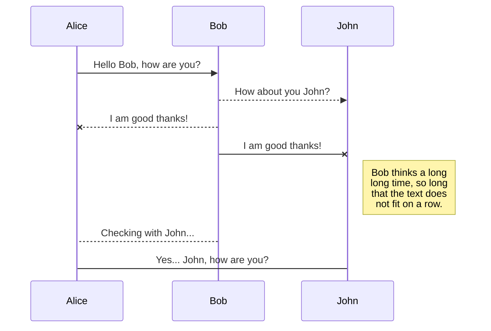
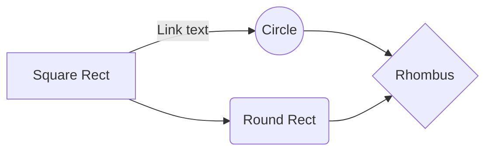

# Calculadora - Main test
Descripcion

## DEPENDENCIAS:
* UI_v2.msa: initdis,clrdis,println,waitkey,outchar,numForm *
* string.msa: int4str,str2int *
* math_ops.msa: op_suma,op_rest,op_div,op_mul *
* utils.msa: delay *
* str_hand.def (string handlers) *
* op_hand.def (operation handlers) *
* flowctrl.def (flow control macros) *

Para LINKEAR:  	
`link11_2 maintest,UI_v2,string,math_ops,utils`

## Casos de error

Casos en los que las operaciones matematicas dan error

|  OPER          |ERROR                          |test|
|----------------|-------------------------------|-----------------------------|
|suma		| result > 999            |            |
|Quotes          |`"Isn't this fun?"`            |"Isn't this fun?"            |
|Dashes          |`-- is en-dash, --- is em-dash`|-- is en-dash, --- is em-dash|

## Editar markdown online
https://stackedit.io/app#

## KaTeX

You can render LaTeX mathematical expressions using [KaTeX](https://khan.github.io/KaTeX/):

The *Gamma function* satisfying $\Gamma(n) = (n-1)!\quad\forall n\in\mathbb N$ is via the Euler integral

$$
\Gamma(z) = \int_0^\infty t^{z-1}e^{-t}dt\,.
$$

> You can find more information about **LaTeX** mathematical expressions [here](http://meta.math.stackexchange.com/questions/5020/mathjax-basic-tutorial-and-quick-reference).

## UML diagrams

You can render UML diagrams using [Mermaid](https://mermaidjs.github.io/). For example, this will produce a sequence diagram:

And this will produce a flow chart:

